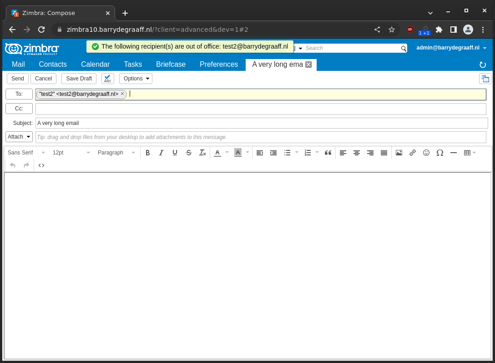

# Out Of Office Alert Zimlet

This Classic UI Zimlets displays an alert as soon as you enter an email address in to/cc/bcc of someone with an active out of office reply. Avoid putting time in writing an email just to be greeted with an out-of-office message after sending an email.



## Installing

```
mkdir /opt/zimbra/lib/ext/outofofficealert
wget https://github.com/Zimbra/out-of-office-alert-zimlet/releases/download/0.0.1/outofofficebanner.jar -O /opt/zimbra/lib/ext/outofofficealert/outofofficebanner.jar
sudo su - zimbra
wget https://github.com/Zimbra/out-of-office-alert-zimlet/releases/download/0.0.1/com_zimbra_outofoffice_alert.zip -O /tmp/com_zimbra_outofoffice_alert.zip
zmzimletctl deploy /tmp/com_zimbra_outofoffice_alert.zip
zmmailboxdctl restart
```
